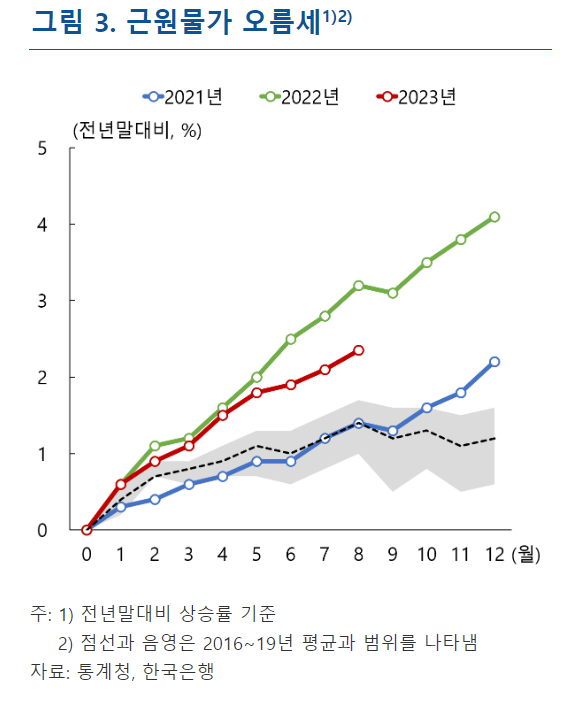
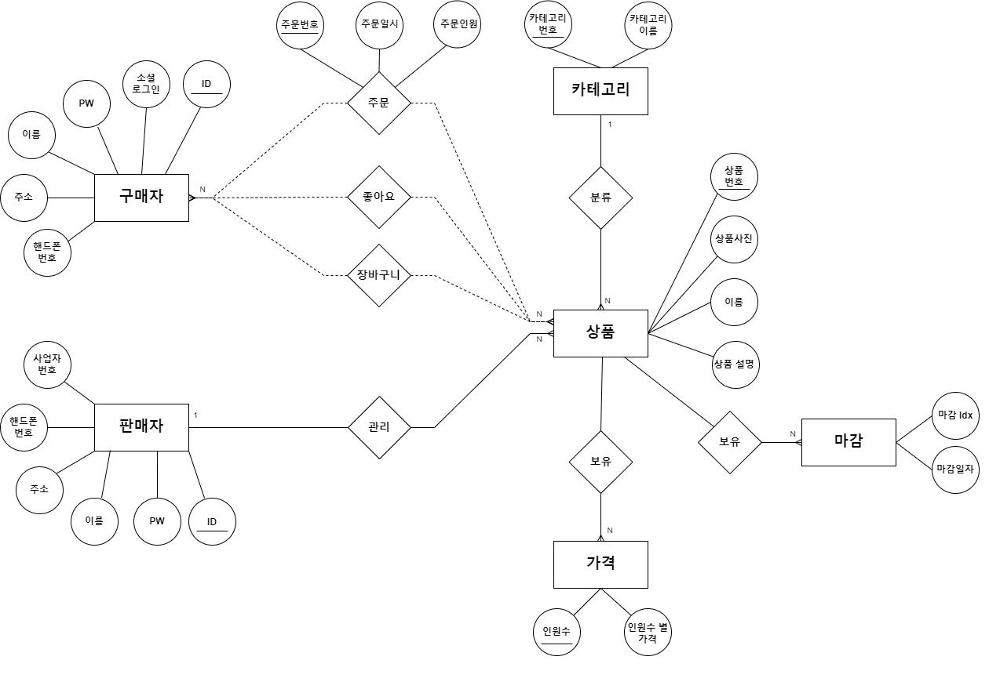
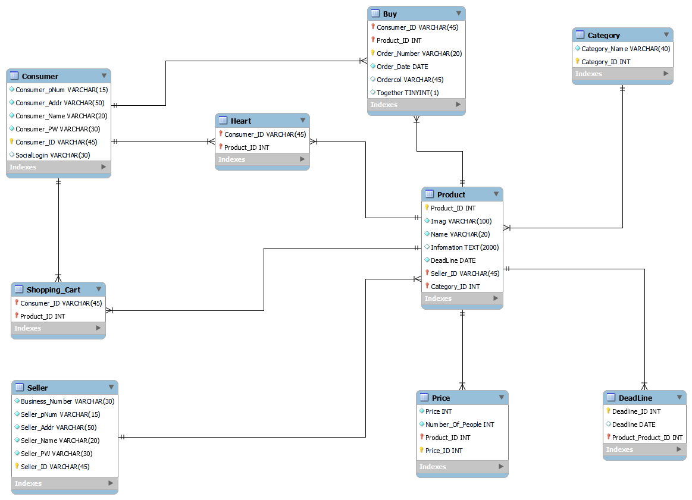

<h1 align="center">팜팜 🎁</h1>

<!-- 

    

 -->

> [플레이 데이터] 한화시스템 BEYOND SW캠프 / pampam

## 🎬[Demo 시연영상]

### 1. 방화벽 및 MySQL Server 구동
   

### 2. 라우터 및 쉘스크립트 파일 실행
   

### 3.1 클러스터 모드 확인
 

### 3.2 클러스터 모드 변경.gif
 

### 4.1 6446번 포트 확인 (Read/Write)
 

### 4.2 6447번 포트 확인 (Read/Write)
   

[//]: # (📃[프로젝트 회고록])

 

## :pencil: 프로젝트 설명

    

최근 1년간 물가 상승으로 인해 소비자들은 더 저렴한 가격으로 품질 좋은 제품을 구매하고 싶어합니다. 이에 따라 저희 공동구매 서비스는 이러한 소비자의 요구사항을 충족시켜줄 하나의 대안이 될 수 있습니다.   최근 소비자들 간 협력을 통해 다양한 제품을 합리적인 가격으로 구매할 수 있는 효과적인 방법 중 하나로 공동구매가 부상하고 있습니다. 저희 공동구매 플랫폼은 여러 참여자들을 하나의 그룹으로 모아 원하는 물품을 구매할 수 있습니다.

## :dart: 프로젝트 목표

저희 프로젝트의 주요 목표는 소비자들이 원하는 제품을 공동으로 구매하여 가격을 낮추고, 동시에 지역 사회와 소상공인을 지원하는 플랫폼을 구축하는 것입니다.  다양한 제품에 대한 공동 구매를 통해 소비자는 저렴한 가격에 구매하고,  지역 사회의 소상공인 들은 자사 제품을 홍보하고 판매할 수 있는 기회를 얻게 될 것 입니다.

### ERD

    

### 릴레이션 스키마

    

 

## 🤼‍♂️팀원

🐯 **정동섭**

🐶 **박현범**

🐺 **양호신**

🐱 **백송연**
